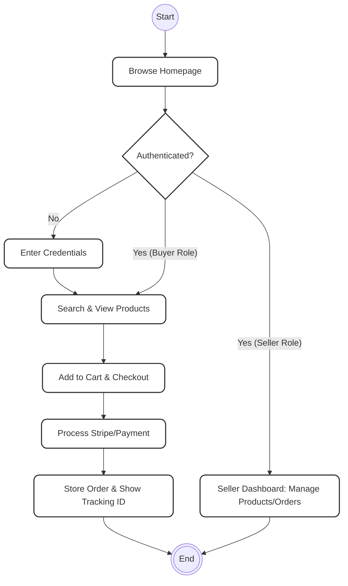

```mermaid
flowchart TD
    %% Node Definitions
    Start((Start))
    Homepage[Browse Homepage]
    Login{Authenticated?}
    LoginAction[Enter Credentials]
    Dashboard[Seller Dashboard: Manage Products/Orders]
    Browse[Search & View Products]
    Cart[Add to Cart & Checkout]
    Payment[Process Stripe/Payment]
    Success[Store Order & Show Tracking ID]
    End(((End)))

    %% Flow Definitions
    Start --> Homepage
    Homepage --> Login
    
    %% Seller Path
    Login -- Yes (Seller Role) --> Dashboard
    
    %% Buyer Path
    Login -- No --> LoginAction
    LoginAction --> Browse
    Login -- Yes (Buyer Role) --> Browse
    
    Browse --> Cart
    Cart --> Payment
    Payment --> Success
    Success --> End
    Dashboard --> End
    
    %% Styling to resemble UML Activity Diagram
    classDef action fill:#fff,stroke:#333,stroke-width:2px,rx:10;
    classDef decision fill:#fff,stroke:#333,stroke-width:2px;
    class Homepage,LoginAction,Dashboard,Browse,Cart,Payment,Success action;
    class Login decision;
    
```
