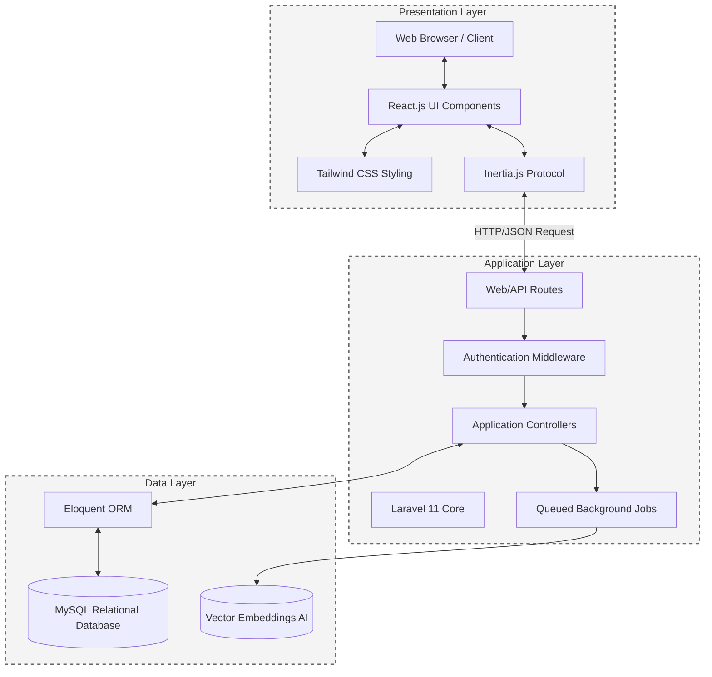

```mermaid
flowchart TB
    %% Client Tier
    subgraph Presentation [Presentation Layer]
        Browser[Web Browser / Client]
        React[React.js UI Components]
        Tailwind[Tailwind CSS Styling]
        Inertia[Inertia.js Protocol]
        
        Browser <--> React
        React <--> Tailwind
        React <--> Inertia
    end

    %% Application Tier (Backend)
    subgraph Application [Application Layer]
        Laravel[Laravel 11 Core]
        Routes[Web/API Routes]
        Auth[Authentication Middleware]
        Controllers[Application Controllers]
        Jobs[Queued Background Jobs]
        
        Inertia <-->|HTTP/JSON Request| Routes
        Routes --> Auth
        Auth --> Controllers
        Controllers --> Jobs
    end

    %% Data Tier
    subgraph Data [Data Layer]
        ORM[Eloquent ORM]
        MySQL[(MySQL Relational Database)]
        Vector[(Vector Embeddings AI)]
        
        Controllers <--> ORM
        Jobs --> Vector
        ORM <--> MySQL
    end
    
    %% Aesthetics
    classDef layer fill:#f4f4f4,stroke:#666,stroke-width:2px,stroke-dasharray: 5 5;
    class Presentation,Application,Data layer;
```
