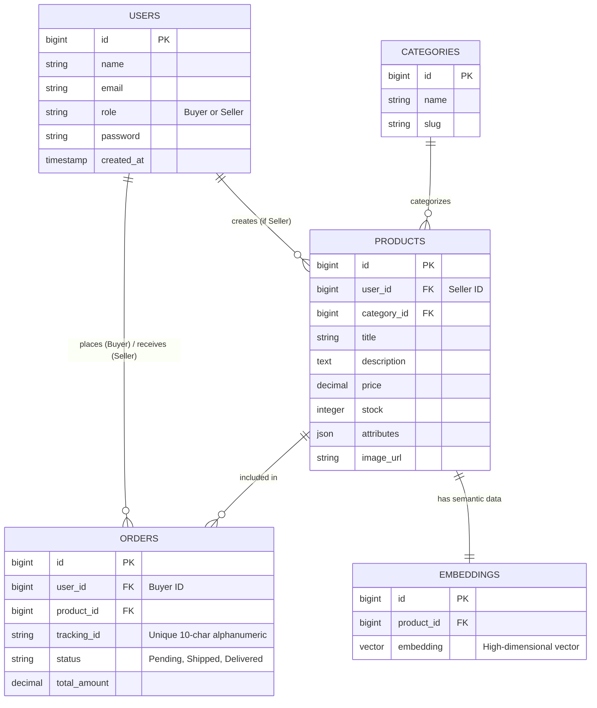

```mermaid
erDiagram
    USERS ||--o{ PRODUCTS : "creates (if Seller)"
    USERS ||--o{ ORDERS : "places (Buyer) / receives (Seller)"
    PRODUCTS ||--o{ ORDERS : "included in"
    PRODUCTS ||--|| EMBEDDINGS : "has semantic data"
    CATEGORIES ||--o{ PRODUCTS : "categorizes"

    USERS {
        bigint id PK
        string name
        string email
        string role "Buyer or Seller"
        string password
        timestamp created_at
    }

    PRODUCTS {
        bigint id PK
        bigint user_id FK "Seller ID"
        bigint category_id FK
        string title
        text description
        decimal price
        integer stock
        json attributes
        string image_url
    }

    ORDERS {
        bigint id PK
        bigint user_id FK "Buyer ID"
        bigint product_id FK
        string tracking_id "Unique 10-char alphanumeric"
        string status "Pending, Shipped, Delivered"
        decimal total_amount
    }

    EMBEDDINGS {
        bigint id PK
        bigint product_id FK
        vector embedding "High-dimensional vector"
    }
    
    CATEGORIES {
        bigint id PK
        string name
        string slug
    }
```
