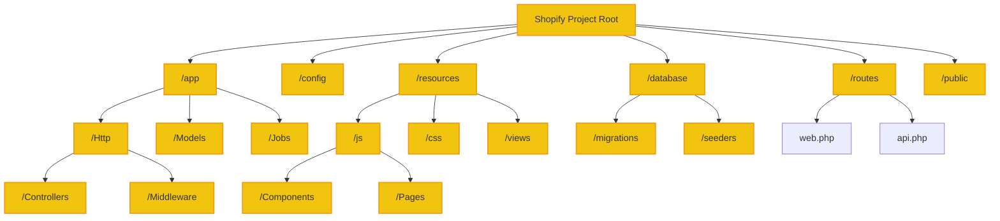

```mermaid
graph TD
    %% Root Level
    Root["Shopify Project Root"]
    
    %% Main Branches
    Root --> App["/app"]
    Root --> Config["/config"]
    Root --> Database["/database"]
    Root --> Resources["/resources"]
    Root --> Routes["/routes"]
    Root --> Public["/public"]

    %% App Subdirectories
    App --> Http["/Http"]
    App --> Models["/Models"]
    App --> Jobs["/Jobs"]
    
    Http --> Controllers["/Controllers"]
    Http --> Middleware["/Middleware"]
    
    %% Resource Subdirectories
    Resources --> JS["/js"]
    Resources --> Css["/css"]
    Resources --> Views["/views"]
    
    JS --> Components["/Components"]
    JS --> Pages["/Pages"]
    
    %% Database Subdirectories
    Database --> Migrations["/migrations"]
    Database --> Seeders["/seeders"]
    
    %% Routes Subdirectories
    Routes --> WebRoutes["web.php"]
    Routes --> ApiRoutes["api.php"]
    
    classDef folder fill:#f1c40f,stroke:#f39c12,stroke-width:2px;
    class Root,App,Config,Database,Resources,Routes,Public,Http,Models,Jobs,Controllers,Middleware,JS,Css,Views,Components,Pages,Migrations,Seeders folder;
```
