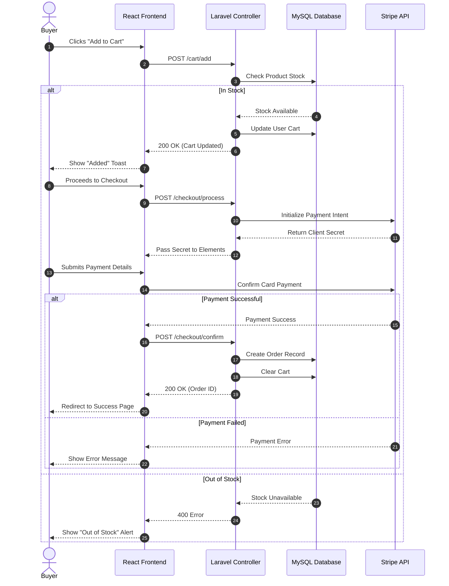

```mermaid
sequenceDiagram
    autonumber
    
    actor User as Buyer
    participant UI as React Frontend
    participant Controller as Laravel Controller
    participant DB as MySQL Database
    participant API as Stripe API

    User->>UI: Clicks "Add to Cart"
    UI->>Controller: POST /cart/add
    Controller->>DB: Check Product Stock
    
    alt In Stock
        DB-->>Controller: Stock Available
        Controller->>DB: Update User Cart
        Controller-->>UI: 200 OK (Cart Updated)
        UI-->>User: Show "Added" Toast
        
        User->>UI: Proceeds to Checkout
        UI->>Controller: POST /checkout/process
        Controller->>API: Initialize Payment Intent
        API-->>Controller: Return Client Secret
        Controller-->>UI: Pass Secret to Elements
        
        User->>UI: Submits Payment Details
        UI->>API: Confirm Card Payment
        
        alt Payment Successful
            API-->>UI: Payment Success
            UI->>Controller: POST /checkout/confirm
            Controller->>DB: Create Order Record
            Controller->>DB: Clear Cart
            Controller-->>UI: 200 OK (Order ID)
            UI-->>User: Redirect to Success Page
        else Payment Failed
            API-->>UI: Payment Error
            UI-->>User: Show Error Message
        end
        
    else Out of Stock
        DB-->>Controller: Stock Unavailable
        Controller-->>UI: 400 Error
        UI-->>User: Show "Out of Stock" Alert
    end
```
