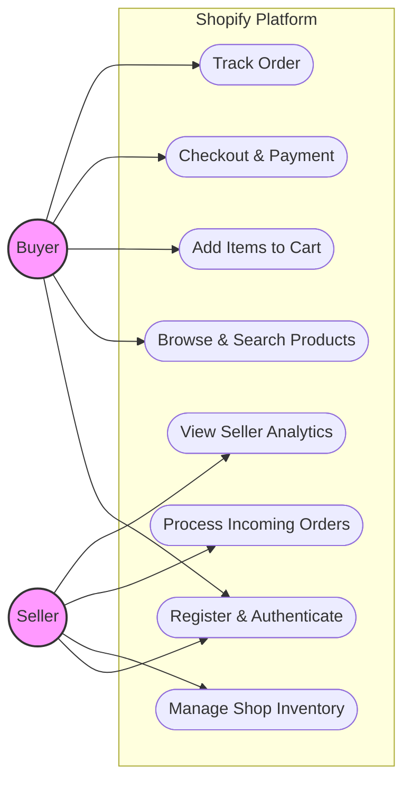

```mermaid
flowchart LR
    %% Actors
    Buyer((Buyer))
    Seller((Seller))

    %% System Boundary
    subgraph Shopify Platform
        UC1([Register & Authenticate])
        UC2([Browse & Search Products])
        UC3([Add Items to Cart])
        UC4([Checkout & Payment])
        UC5([Track Order])
        UC6([Manage Shop Inventory])
        UC7([Process Incoming Orders])
        UC8([View Seller Analytics])
    end

    %% Buyer Interactions
    Buyer --> UC1
    Buyer --> UC2
    Buyer --> UC3
    Buyer --> UC4
    Buyer --> UC5

    %% Seller Interactions
    Seller --> UC1
    Seller --> UC6
    Seller --> UC7
    Seller --> UC8

    %% Aesthetics
    classDef actor fill:#f9f,stroke:#333,stroke-width:2px;
    class Buyer,Seller actor;
```
